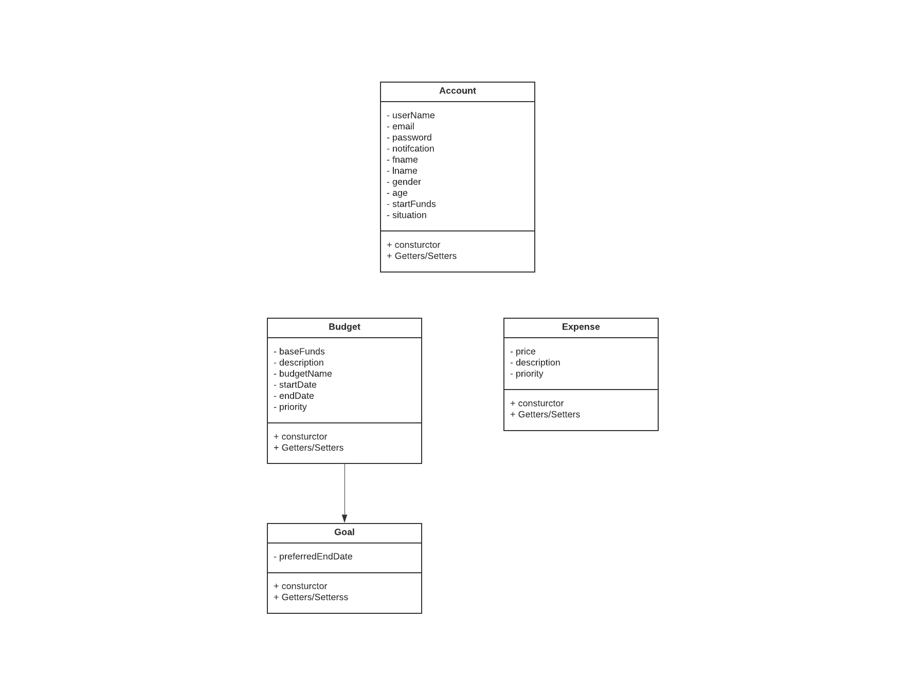
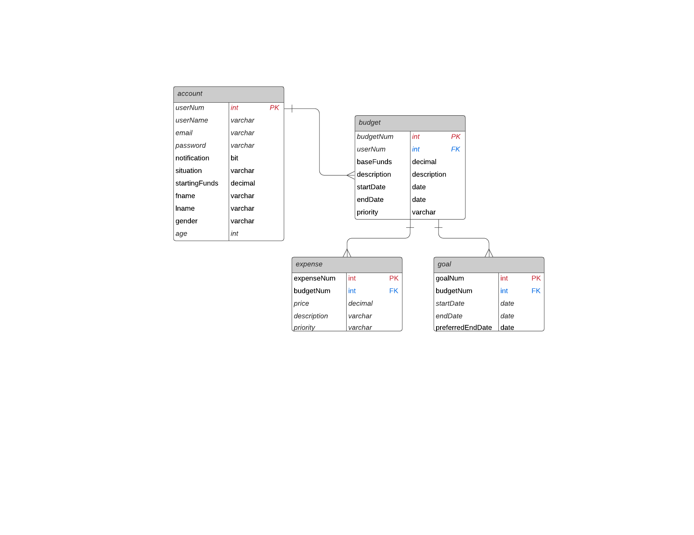

## final-project
SDEV 328 Final Project

# Project Requirements
*1 Separates all database/business logic using the MVC pattern.
    - All database queries are located in the data-layer file.

*2 Routes all URLs and leverages a templating language using the Fat-Free framework.
    - Routes and templating are defined and managed in index and controller files

*3 Has a clearly defined database layer using PDO and prepared statements. You should have at least two related tables.
    - All database queries are located in the data-layer file.

*4 Data can be viewed and added.
    - Site allows creation and can display user's budget(s) and expense(s)

*5 Has a history of commits from both team members to a Git repository. Commits are clearly commented.
    - Have committed frequently with meaningful commit messages

*6 Uses OOP, and defines multiple classes, including at least one inheritance relationship.
    - Classes define account, budgets, and expenses

*7 Contains full Docblocks for all PHP files and follows PEAR standards.
    - Docblocks included where appropriate

*8 Has full validation on the client side through JavaScript and server side through PHP.
    - Contains validation as well as sticky-form data as well as form spoofing prevention

*9 All code is clean, clear, and well-commented. DRY (Don't Repeat Yourself) is practiced.
    - Code style adheres to PEAR standards

*10 Your submission shows adequate effort for a final project in a full-stack web development course.
* BONUS:  Incorporates Ajax that access data from a JSON file, PHP script, or API. If you implement Ajax, be sure to describe it in your readme file.
    - N/A

# UML Diagram

# ER Diagram
